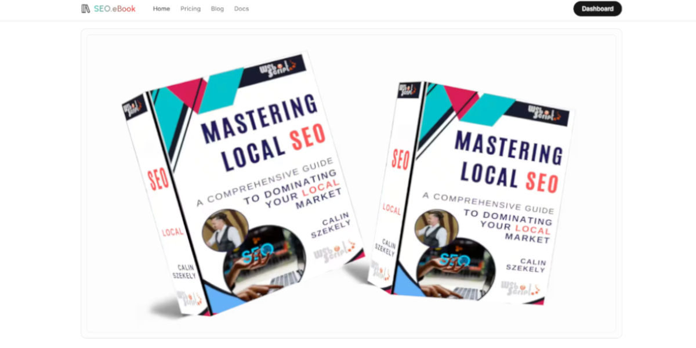

<a href="https://seolocal.markets">
  
  <h1 align="center">Mastering Local SEO eBook</h1>
</a>

<p align="center">
  Start your local SEO journey with the Mastering Local SEO eBook. Learn how to optimize your business for local search and attract more customers.
</p>

<p align="center">
  <a href="https://x.com/local_seo_game">
    
  </a>
</p>

<ul align="center" style="list-style-type: none;">
  <li>💸 USD 6 discount applied at checkout</li>
  <li>📚 Learn how to optimize your business for local search</li>
  <li>📈 Attract more customers with local SEO</li>
  <li>🔍 Discover the secrets to ranking higher in local search results</li>
  <li>📱 Optimize your website for mobile search</li>
  <li>🌐 Get your business listed on Google Maps</li>
  <li>📝 Create a local SEO strategy that works</li>
  <li>📊 Track your progress and measure your success</li>
  <li>🚀 Take your business to the next level with local SEO</li>
<br/>
<button align="center" style="border-radius: 12px;
  border: none;
  padding: 10px 32px;
  text-align: center;
  text-decoration: none;
  display: inline-block;
  font-size: 16px;
  margin: 4px 2px;
  cursor: pointer;">
  <a href="https://seolocal.markets/pricing">Get the eBook</a>
</button>
</ul>
<br/>

<ul align="center" style="list-style-type: none;">
  <li>📚 <a href="#introduction"><strong>Introduction</strong></a></li>
  <li>💸 <a href="#pricing"><strong>Pricing</strong></a></li>
  <li>🌐 <a href="#formats"><strong>eBook formats available</strong></a></li>
  <li>😎 <a href="#author"><strong>About the Author</strong></a></li>
  <li>🤙 <a href="#use"><strong>Can I use this repo?</strong></a></li>
  <li>⚒️ <a href="#tech-stack"><strong>Tech Stack</strong></a></li>
  <li>❔ <a href="#features"><strong>Features</strong></a></li>
  <li>🧑‍💻 <a href="#installation"><strong>Installation</strong></a></li>
  <li>📚 <a href="#credits"><strong>Credits</strong></a></li>
</ul>

<br/>

## Introduction

The Mastering Local SEO eBook is a comprehensive guide to optimizing your business for local search. Learn how to attract more customers and increase your online visibility with local SEO strategies. This eBook covers everything you need to know about local SEO, from optimizing your website for mobile search to creating a local SEO strategy that works. Whether you're a small business owner or a marketing professional, this eBook will help you take your business to the next level with local SEO.
<br/>

The Mastering Local SEO eBook is available for purchase at [seolocal.markets](https://seolocal.markets/pricing).

## Pricing

The Mastering Local SEO eBook is available in different formats, including PDF, ePub, and Print Ready PDF. Also,
our book can be purchased on Amazon, where you can get the <strong>Kindle version, Paperback, and Hardcover.</strong>

The eBook is priced at USD 15.99, with a discount of <strong>USD 6</strong> auto applied at checkout. Get your copy today and start optimizing your business for local search.

<button align="center" style="border-radius: 12px;
  border: none;
  padding: 10px 32px;
  text-align: center;
  text-decoration: none;
  display: inline-block;
  font-size: 16px;
  margin: 4px 2px;
  cursor: pointer;">
<a href="https://seolocal.markets/pricing">Pricing</a>
</button>

## Formats

The Mastering Local SEO eBook is available in the following formats:

- PDF
- ePub
- Print Ready PDF
- Kindle
- Paperback
- Hardcover

But if you want to get the eBook in a different format, please contact us at [hello@seolocal.markets](mailto:hello@seolocal.markets).

## Author

The Mastering Local SEO eBook was written by Calin S. the CEO of [WebScript - SEO.eBook](https://seolocal.markets). WebScript is a web development and digital marketing agency that specializes in SEO and local search optimization. Calin has over 7 years of experience in the digital marketing industry and has helped numerous businesses improve their online visibility and attract more customers through local SEO strategies.

## Use

The SEO.eBook repo is released under the MIT license. You are free to use this repo as a template for your own website or eBook project. If you have any questions or need help getting started, feel free to reach out to us at
[hello@webscript.ro](mailto:hello@webscript.ro).

Test our website at [seolocal.markets](https://seolocal.markets). Even if you don't buy the eBook, we would appreciate it if you could give us a star on GitHub. This helps us reach more people who can benefit from our resources.

## Tech Stack

The Mastering Local SEO eBook is built with the following technologies:

### Frameworks

- [Next.js](https://nextjs.org/) – React framework for building performant apps with the best developer experience
- [Auth.js](https://authjs.dev/) – Handle user authentication with ease with providers like Google, Twitter, GitHub, etc.
- [Prisma](https://www.prisma.io/) – Typescript-first ORM for Node.js
- [React Email](https://react.email/) – Versatile email framework for efficient and flexible email development

### Database

- [PostgreSQL](https://www.postgresql.org/) – The world's most advanced open-source relational database

### Hosting

- [WebScript](https://webscript.ro/en) – Web development and digital marketing agency that specializes in SEO and local search optimization

### Security

- [Cloudflare](https://www.cloudflare.com/) – Web security, performance, and reliability
- [Stripe](https://stripe.com/) – Payment processing platform for online businesses

### Storage

- [Amazon S3](https://aws.amazon.com/s3/) – Scalable object storage for developers

### Analytics

- [Google Analytics](https://analytics.google.com/) – Web analytics service that tracks and reports website traffic

### UI

- [Tailwind CSS](https://tailwindcss.com/) – Utility-first CSS framework for rapid UI development
- [Shadcn/ui](https://ui.shadcn.com/) – Re-usable components built using Radix UI and Tailwind CSS
- [Framer Motion](https://framer.com/motion) – Motion library for React to animate components with ease
- [Lucide](https://lucide.dev/) – Beautifully simple, pixel-perfect icons
- [`next/font`](https://nextjs.org/docs/basic-features/font-optimization) – Optimize custom fonts and remove external network requests for improved performance
- [`ImageResponse`](https://nextjs.org/docs/app/api-reference/functions/image-response) – Generate dynamic Open Graph images at the edge

### Code Quality

- [TypeScript](https://www.typescriptlang.org/) – Static type checker for end-to-end typesafety
- [Prettier](https://prettier.io/) – Opinionated code formatter for consistent code style
- [ESLint](https://eslint.org/) – Pluggable linter for Next.js and TypeScript

## Features

- [x] User authentication with Auth.js
- [x] Product payments with Stripe
- [x] Email marketing with React Email
- [x] Database management with Prisma
- [x] SEO optimization with Next.js
- [x] Scalable object storage with Amazon S3
- [x] Web security with Cloudflare
- [x] Payment processing with Stripe
- [x] Web analytics with Google Analytics
- [x] UI components with Tailwind CSS
- [x] Cookie ready with Next.js
- [x] Image optimization with next/image

## Installation

Clone & create this repo locally using the following commands:

```sh
git clone <repo-url>
cd seo-ebook
```

### Steps

1. Install dependencies using pnpm:

```sh
pnpm install
```

2. Copy `.env.example` to `.env.local` and update the variables.

```sh
cp .env.example .env.local
```

3. Start the development server:

```sh
pnpm dev
```

## Roadmap

- [ ] Add Amazon SES for email marketing
- [ ] Add Google Maps API for location-based services
- [ ] Code refactoring for improved performance

## Credits

- Powered by [WebScript](https://webscript.ro/en)

- SEO.eBook is a brand of WebScript developed for the eBook author Calin S.

- Based on [next-saas-starter](https://github.com/mickasmt/next-saas-stripe-starter) by [miickasmt](https://x.com/miickasmt)
